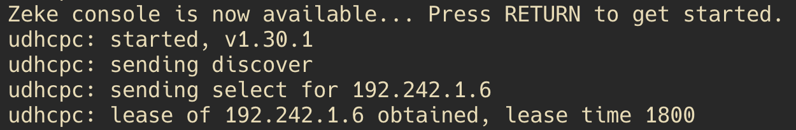
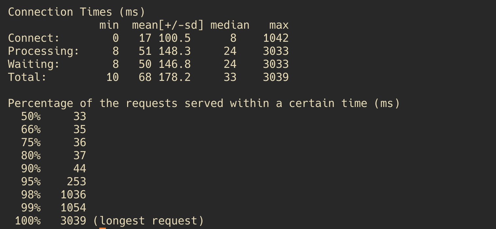

# Jarkom-Modul-3-IT18-2024

**KELOMPOK IT18**
| Nama | NRP |
|---------------------------|------------|
|Hazwan Adhikara Nasution | 5027231017 |
|Farand Febriansyah | 5027231084 |

<hr>

## Topology


## Network Configuration

#### > Paradis (Router)

```
auto eth0
iface eth0 inet dhcp

auto eth1
iface eth1 inet static
	address 192.242.1.1
	netmask 255.255.255.0

auto eth2
iface eth2 inet static
	address 192.242.2.1
	netmask 255.255.255.0

auto eth3
iface eth3 inet static
	address 192.242.3.1
	netmask 255.255.255.0

auto eth4
iface eth4 inet static
	address 192.242.4.1
	netmask 255.255.255.0
```

#### > Annie

```
auto eth0
iface eth0 inet static
	address 192.242.1.2
	netmask 255.255.255.0
	gateway 192.242.1.1
```

#### > Bertholdt

```
auto eth0
iface eth0 inet static
	address 192.242.1.3
	netmask 255.255.255.0
	gateway 192.242.1.1
```

#### > Reiner

```
auto eth0
iface eth0 inet static
	address 192.242.1.4
	netmask 255.255.255.0
	gateway 192.242.1.1
```

#### > Armin

```
auto eth0
iface eth0 inet static
	address 192.242.2.2
	netmask 255.255.255.0
	gateway 192.242.2.1
```

#### > Eren

```
auto eth0
iface eth0 inet static
	address 192.242.2.3
	netmask 255.255.255.0
	gateway 192.242.2.1
```

#### > Mikasa

```
auto eth0
iface eth0 inet static
	address 192.242.2.4
	netmask 255.255.255.0
	gateway 192.242.2.1
```

#### > Beast

```
auto eth0
iface eth0 inet static
	address 192.242.3.2
	netmask 255.255.255.0
	gateway 192.242.3.1
```

#### > Colossal

```
auto eth0
iface eth0 inet static
	address 192.242.3.3
	netmask 255.255.255.0
	gateway 192.242.3.1
```

#### > Warhammer

```
auto eth0
iface eth0 inet static
	address 192.242.3.4
	netmask 255.255.255.0
	gateway 192.242.3.1
```

#### > Fritz

```
auto eth0
iface eth0 inet static
	address 192.242.4.2
	netmask 255.255.255.0
	gateway 192.242.4.1
```

#### > Tybur

```
auto eth0
iface eth0 inet static
	address 192.242.4.3
	netmask 255.255.255.0
	gateway 192.242.4.1
```

## Notes

- `Prefix IP = 192.242`

## Setup Node

#### Paradis (Router)

```
iptables -t nat -A POSTROUTING -o eth0 -j MASQUERADE -s 192.242.0.0/16
apt-get update
apt install isc-dhcp-relay -y
```

#### Tybur (DHCP Server)

```
echo 'nameserver 192.242.4.2' > /etc/resolv.conf
apt-get update
apt-get install isc-dhcp-server -y
```

#### Fritz (DNS Server)

```
echo 'nameserver 192.168.122.1' > /etc/resolv.conf
apt-get update
apt-get install bind9 -y

echo 'options {
        directory "/var/cache/bind";

        forwarders {
                192.168.122.1;
        };

        // dnssec-validation auto;
        allow-query{any;};
        auth-nxdomain no;
        listen-on-v6 { any; };
}; ' >/etc/bind/named.conf.options

service bind9 restart
```

#### Warhammer (Database Server)

```
echo 'nameserver 192.242.4.2' > /etc/resolv.conf
apt-get update
apt-get install mariadb-server -y
service mysql start
```

#### Load Balancer (Beast, Colossal)

```
echo 'nameserver 192.242.4.2' > /etc/resolv.conf
apt-get update
apt-get install apache2-utils -y
apt-get install nginx -y
apt-get install lynx -y

service nginx start
```

#### Laravel Worker (Annie, Bertholdt, Reiner)

```
apt-get update
apt-get install lynx -y
apt-get install mariadb-client -y
apt-get install -y lsb-release ca-certificates apt-transport-https software-properties-common gnupg2
apt-get install curl -y
curl -sSLo /usr/share/keyrings/deb.sury.org-php.gpg https://packages.sury.org/php/apt.gpg
sh -c 'echo "deb [signed-by=/usr/share/keyrings/deb.sury.org-php.gpg] https://packages.sury.org/php/ $(lsb_release -sc) main" > /etc/apt/sources.list.d/php.list'
apt-get update
apt-get install php8.0-mbstring php8.0-xml php8.0-cli   php8.0-common php8.0-intl php8.0-opcache php8.0-readline php8.0-mysql php8.0-fpm php8.0-curl unzip wget -y
apt-get install nginx -y
apt-get install git -y
apt-get install htop -y

service nginx start
service php8.0-fpm start
```

#### PHP Worker (Armin, Eren, Mikasa)

```
echo 'nameserver 192.242.4.2' > /etc/resolv.conf
apt-get update
apt-get install nginx -y
apt-get install wget -y
apt-get install unzip -y
apt-get install lynx -y
apt-get install htop -y
apt-get install apache2-utils -y
apt-get install php7.3-fpm php7.3-common php7.3-mysql php7.3-gmp php7.3-curl php7.3-intl php7.3-mbstring php7.3-xmlrpc php7.3-gd php7.3-xml php7.3-cli php7.3-zip -y

service nginx start
service php7.3-fpm start
```

#### Client (Zeke, Erwin)

```
apt update
apt install lynx -y
apt install htop -y
apt install apache2-utils -y
apt-get install jq -y
```

## Soal 0

Pulau Paradis telah menjadi tempat yang damai selama 1000 tahun, namun kedamaian tersebut tidak bertahan selamanya. Perang antara kaum Marley dan Eldia telah mencapai puncak. Kaum Marley yang dipimpin oleh Zeke, me-register domain name marley.yyy.com untuk worker Laravel mengarah pada Annie. Namun ternyata tidak hanya kaum Marley saja yang berinisiasi, kaum Eldia ternyata sudah mendaftarkan domain name eldia.yyy.com untuk worker PHP (0) mengarah pada Armin.

`bisa gunakan script, atau config seperti ini pada dns-server(Fritz):`

Config `named.conf.local`


Config `named.conf.options`


`marley.it18.com`


`eldia.it18.com`


> Jangan lupa untuk restart, lalu test ping pada client (Zeke dan Erwin)

_Zeke_


_Erwin_


## Soal 1-5

Lakukan konfigurasi sesuai dengan peta yang sudah diberikan.

Jauh sebelum perang dimulai, ternyata para keluarga bangsawan, Tybur dan Fritz, telah membuat kesepakatan sebagai berikut:

1. Semua Client harus menggunakan konfigurasi ip address dari keluarga Tybur (dhcp).
2. Client yang melalui bangsa marley mendapatkan range IP dari [prefix IP].1.05 - [prefix IP].1.25 dan [prefix IP].1.50 - [prefix IP].1.100
3. Client yang melalui bangsa eldia mendapatkan range IP dari [prefix IP].2.09 - [prefix IP].2.27 dan [prefix IP].2 .81 - [prefix IP].2.243
4. Client mendapatkan DNS dari keluarga Fritz dan dapat terhubung dengan internet melalui DNS tersebut
5. Dikarenakan keluarga Tybur tidak menyukai kaum eldia, maka mereka hanya meminjamkan ip address ke kaum eldia selama 6 menit. Namun untuk kaum marley, keluarga Tybur meminjamkan ip address selama 30 menit. Waktu maksimal dialokasikan untuk peminjaman alamat IP selama 87 menit.

_Pastikan DHCP Server dan Relay sudah run, dengan cara:_

`Tybur`

```bash
echo 'nameserver 192.168.122.1' > /etc/resolv.conf

apt-get update
apt-get install isc-dhcp-server -y

echo 'INTERFACESv4="eth0"' > /etc/default/isc-dhcp-server
echo 'INTERFACESv6=""' >> /etc/default/isc-dhcp-server

echo 'option domain-name "example.org";' > /etc/dhcp/dhcpd.conf
echo 'option domain-name-servers ns1.example.org, ns2.example.org;' >> /etc/dhcp/dhcpd.conf
echo '' >> /etc/dhcp/dhcpd.conf
echo 'default-lease-time 600;' >> /etc/dhcp/dhcpd.conf
echo 'max-lease-time 7200;' >> /etc/dhcp/dhcpd.conf
echo '' >> /etc/dhcp/dhcpd.conf
echo 'ddns-update-style none;' >> /etc/dhcp/dhcpd.conf
echo '' >> /etc/dhcp/dhcpd.conf

echo 'subnet 192.242.1.0 netmask 255.255.255.0 {' >> /etc/dhcp/dhcpd.conf
echo '    range 192.242.1.5 192.242.1.25;' >> /etc/dhcp/dhcpd.conf
echo '    range 192.242.1.50 192.242.1.100;' >> /etc/dhcp/dhcpd.conf
echo '    option routers 192.242.1.1;' >> /etc/dhcp/dhcpd.conf
echo '    option broadcast-address 192.242.1.255;' >> /etc/dhcp/dhcpd.conf
echo '    option domain-name-servers 192.242.4.2;' >> /etc/dhcp/dhcpd.conf
echo '    default-lease-time 1800;' >> /etc/dhcp/dhcpd.conf
echo '    max-lease-time 5220;' >> /etc/dhcp/dhcpd.conf
echo '}' >> /etc/dhcp/dhcpd.conf
echo '' >> /etc/dhcp/dhcpd.conf

echo 'subnet 192.242.2.0 netmask 255.255.255.0 {' >> /etc/dhcp/dhcpd.conf
echo '    range 192.242.2.9 192.242.2.27;' >> /etc/dhcp/dhcpd.conf
echo '    range 192.242.2.81 192.242.2.243;' >> /etc/dhcp/dhcpd.conf
echo '    option routers 192.242.2.1;' >> /etc/dhcp/dhcpd.conf
echo '    option broadcast-address 192.242.2.255;' >> /etc/dhcp/dhcpd.conf
echo '    option domain-name-servers 192.242.4.2;' >> /etc/dhcp/dhcpd.conf
echo '    default-lease-time 360;' >> /etc/dhcp/dhcpd.conf
echo '    max-lease-time 5220;' >> /etc/dhcp/dhcpd.conf
echo '}' >> /etc/dhcp/dhcpd.conf
echo '' >> /etc/dhcp/dhcpd.conf

echo 'subnet 192.242.3.0 netmask 255.255.255.0 {' >> /etc/dhcp/dhcpd.conf
echo '}' >> /etc/dhcp/dhcpd.conf
echo '' >> /etc/dhcp/dhcpd.conf

echo 'subnet 192.242.4.0 netmask 255.255.255.0 {' >> /etc/dhcp/dhcpd.conf
echo '}' >> /etc/dhcp/dhcpd.conf

service isc-dhcp-server restart
```

`Paradis`

```bash
echo 'nameserver 192.168.122.1' > /etc/resolv.conf

apt-get update
apt-get install isc-dhcp-relay -y
service isc-dhcp-relay start

echo 'SERVERS="192.242.4.3"' > /etc/default/isc-dhcp-relay
echo 'INTERFACES="eth1 eth2 eth3 eth4"' >> /etc/default/isc-dhcp-relay
echo 'OPTIONS=""' >> /etc/default/isc-dhcp-relay

echo 'net.ipv4.ip_forward=1' > /etc/sysctl.conf

service isc-dhcp-relay restart
```

> Setelah kita run script tsb, kita telah menyesuaikan apa yang diminta soal

Lalu kita cek, apakah IP Range beserta lease time yang di set sudah sesuai atau belum melalui Client

`Zeke`



`Erwin`


Test ping marley dan eldia


## Soal 6

Armin berinisiasi untuk memerintahkan setiap worker PHP untuk melakukan konfigurasi virtual host untuk website berikut https://intip.in/BangsaEldia dengan menggunakan php 7.3 (6)

_Jalankan script berikut di semua php worker yaitu; Armin, Eren dan Mikasa_

```bash
echo 'nameserver 192.242.4.2' > /etc/resolv.conf # IP DNS-SERVER

apt-get update

apt-get install nginx -y
apt-get install lynx -y
apt-get install php7.3 php7.3-fpm php7.3-mysql -y   # Install PHP 7.3 dan modul yang diperlukan
apt-get install wget -y
apt-get install unzip -y
apt-get install rsync -y    # Install rsync untuk transfer file

service nginx start
service php7.3-fpm start    # Jalankan PHP-FPM versi 7.3

wget --no-check-certificate 'https://drive.google.com/uc?export=download&id=1ufulgiWyTbOXQcow11JkXG7safgLq1y-' -O '/var/www/modul-3.zip'

unzip -o /var/www/modul-3.zip -d /var/www/
rm /var/www/modul-3.zip

rsync -av /var/www/modul-3/ /var/www/eldia.it18.com/

rm -r /var/www/modul-3

cp /etc/nginx/sites-available/default /etc/nginx/sites-available/eldia.it18.com

ln -s /etc/nginx/sites-available/eldia.it18.com /etc/nginx/sites-enabled/

rm /etc/nginx/sites-enabled/default

echo 'server {
    listen 80;
    server_name _;

    root /var/www/eldia.it18.com;
    index index.php index.html index.htm;

    location / {
        try_files $uri $uri/ /index.php?$query_string;
    }

    location ~ \.php$ {
        include snippets/fastcgi-php.conf;
        fastcgi_pass unix:/run/php/php7.3-fpm.sock;  # Sesuaikan versi PHP dan socket
        fastcgi_param SCRIPT_FILENAME $document_root$fastcgi_script_name;
        include fastcgi_params;
    }
}' > /etc/nginx/sites-available/eldia.it18.com

service nginx restart
service php7.3-fpm restart

```

> Lalu kita masuk ke terminal Client, dan lakukan test menggunakan lynx:

```
lynx 192.242.2.2
```


```
lynx 192.242.2.3
```


```
lynx 192.242.2.4
```


## Soal 7

Dikarenakan Armin sudah mendapatkan kekuatan titan colossal, maka bantulah kaum eldia menggunakan colossal agar dapat bekerja sama dengan baik. Kemudian lakukan testing dengan 6000 request dan 200
request/second. (7)

_Kita perlu jalankan Script dibawah ini untuk setup load balancer pada colossal_

```bash
echo 'nameserver 192.242.4.2' > /etc/resolv.conf

apt-get update

apt-get install apache2-utils -y   # Untuk testing menggunakan ApacheBench (ab)
apt-get install nginx -y           # Install Nginx sebagai load balancer
apt-get install lynx -y            # Install lynx untuk akses web via command line

cp /etc/nginx/sites-available/default /etc/nginx/sites-available/colossal_lb

echo "upstream php_backend {
    server 192.242.2.2;  # Armin
    server 192.242.2.3;  # Eren
    server 192.242.2.4;  # Mikasa
}

server {
    listen 80;
    root /var/www/html;
    index index.html index.htm index.nginx-debian.html;
    server_name eldia.it18.com;

    location / {
        proxy_pass http://php_backend;
        proxy_set_header Host \$host;
        proxy_set_header X-Real-IP \$remote_addr;
        proxy_set_header X-Forwarded-For \$proxy_add_x_forwarded_for;
        proxy_set_header X-Forwarded-Proto \$scheme;
    }
}" > /etc/nginx/sites-enabled/colossal_lb

ln -sf /etc/nginx/sites-available/colossal_lb /etc/nginx/sites-enabled/

rm -r /etc/nginx/sites-enabled/default

service nginx restart
```

**Ubah IP yang dituju pada Fritz (DNS-Server)**


_Kemudian kita melakukan testing pada client dengan menggunakan command berikut_

```
ab -n 6000 -c 200 http://eldia.it18.com/
```




## Soal 8

Karena Erwin meminta “laporan kerja Armin”, maka dari itu buatlah analisis hasil testing dengan 1000 request dan 75 request/second untuk masing-masing algoritma Load Balancer dengan ketentuan sebagai berikut:
a. Nama Algoritma Load Balancer
b. Report hasil testing pada Apache Benchmark
c. Grafik request per second untuk masing masing algoritma.
d. Analisis (8)

_Untuk Melakukan testing semua algoritma load balancer kita gunakan script sebagai berikut_

```bash
echo 'upstream round_robin  {
    server 192.242.2.2 ; #IP Armin
    server 192.242.2.3 ; #IP Eren
    server 192.242.2.4 ; #IP Mikasa
}

server {
    listen 8080;


        location / {
            proxy_pass http://round_robin;
            proxy_set_header    X-Real-IP $remote_addr;
            proxy_set_header    X-Forwarded-For $proxy_add_x_forwarded_for;
            proxy_set_header    Host $http_host;
        }

    error_log /var/log/nginx/lb_error.log;
    access_log /var/log/nginx/lb_access.log;
}' >/etc/nginx/sites-available/round-robin

echo 'upstream generic_hash  {
    hash $request_uri consistent;
    server 192.242.2.2 ; #IP Armin
    server 192.242.2.3 ; #IP Eren
    server 192.242.2.4 ; #IP Mikasa
}

server {
    listen 8081;

        location / {
            proxy_pass http://generic_hash;
            proxy_set_header    X-Real-IP $remote_addr;
            proxy_set_header    X-Forwarded-For $proxy_add_x_forwarded_for;
            proxy_set_header    Host $http_host;
        }

    error_log /var/log/nginx/lb_error.log;
    access_log /var/log/nginx/lb_access.log;
}' >/etc/nginx/sites-available/generic-hash

echo 'upstream ip_hash  {
    ip_hash;
    server 192.242.2.2 ; #IP Armin
    server 192.242.2.3 ; #IP Eren
    server 192.242.2.4 ; #IP Mikasa
}

server {
    listen 8082;

        location / {
            proxy_pass http://ip_hash;
            proxy_set_header    X-Real-IP $remote_addr;
            proxy_set_header    X-Forwarded-For $proxy_add_x_forwarded_for;
            proxy_set_header    Host $http_host;
        }

    error_log /var/log/nginx/lb_error.log;
    access_log /var/log/nginx/lb_access.log;
}' >/etc/nginx/sites-available/ip-hash

echo 'upstream least_conn  {
    least_conn;
    server 192.242.2.2 ; #IP Armin
    server 192.242.2.3 ; #IP Eren
    server 192.242.2.4 ; #IP Mikasa
}

server {
    listen 8083;

        location / {
            proxy_pass http://least_conn;
            proxy_set_header    X-Real-IP $remote_addr;
            proxy_set_header    X-Forwarded-For $proxy_add_x_forwarded_for;
            proxy_set_header    Host $http_host;
        }

    error_log /var/log/nginx/lb_error.log;
    access_log /var/log/nginx/lb_access.log;
}' >/etc/nginx/sites-available/least-conn

unlink /etc/nginx/sites-enabled/default

ln -s /etc/nginx/sites-available/round-robin /etc/nginx/sites-enabled/round-robin
ln -s /etc/nginx/sites-available/generic-hash /etc/nginx/sites-enabled/generic-hash
ln -s /etc/nginx/sites-available/ip-hash /etc/nginx/sites-enabled/ip-hash
ln -s /etc/nginx/sites-available/least-conn /etc/nginx/sites-enabled/least-conn

service nginx restart
```

_Lalu kita bisa membuat laporan pada client dengan script sebagai berikut_

```bash
#!/bin/bash

LB_ADDR="192.243.4.3"

RR_IP="8080"    # IP Round Robin
IPH_IP="8082"   # IP IP Hash
GENH_IP="8081"  # IP Generic Hash

LC3W_IP="8083"  # IP Least Conn 3 Workers
LC2W_IP="8004"  # IP Least Conn 2 Workers
LC1W_IP="8005"  # IP Least Conn 1 Worker

mkdir -p /root/report

RoundRobinTest() {
  AMT=$1
  CON=$2

  echo "$(ab -n $AMT -c $CON http:\/\/$LB_ADDR:$RR_IP\/)" > /root/report/round_robin_test.bin
  echo "Round Robin Test Done"
}

IPHashTest() {
  AMT=$1
  CON=$2

  echo "$(ab -n $AMT -c $CON http:\/\/$LB_ADDR:$IPH_IP\/)" > /root/report/ip_hash_test.bin
  echo "IP Hash Test Done"
}

GenHashTest() {
  AMT=$1
  CON=$2

  echo "$(ab -n $AMT -c $CON http:\/\/$LB_ADDR:$GENH_IP\/)" > /root/report/gen_hash_test.bin
  echo "Generic Hash Test Done"
}

LeastConn3Test() {
  AMT=$1
  CON=$2

  echo "$(ab -n $AMT -c $CON http:\/\/$LB_ADDR:$LC3W_IP\/)" > /root/report/least_conn_3_test.bin
  echo "Least Connection with 3 Workers Test Done"
}

LeastConn2Test() {
  AMT=$1
  CON=$2

  echo "$(ab -n $AMT -c $CON http:\/\/$LB_ADDR:$LC2W_IP\/)" > /root/report/least_conn_2_test.bin
  echo "Least Connection with 2 Workers Test Done"
}

LeastConn1Test() {
  AMT=$1
  CON=$2

  echo "$(ab -n $AMT -c $CON http:\/\/$LB_ADDR:$LC1W_IP\/)" > /root/report/least_conn_1_test.bin
  echo "Least Connection with 1 Worker Test Done"
}

SingleTest() {
  echo "
========== Single Test ==========

Pilih Load Balancer:

1.) Round Robin - 3 Workers
2.) IP Hash - 3 Workers
3.) Generic Hash - 3 Workers
4.) Least Connection - 3 Workers
5.) Least Connection - 2 Workers
6.) Least Connection - 1 Workers
"

  echo -n "Pilih Opsi Pengujian: "
  read optLB

  if [ $optLB -eq 1 ];
  then
    echo -n "Masukkan Jumlah Request: "
    read inReq
    echo -n "Masukkan Jumlah Concurrency: "
    read inCon

    RoundRobinTest $inReq $inCon

    echo -e "\n\n+++++ Laporan Hasil Pengujian Load Balancer +++++"
    echo -e "\nKeterangan Pengujian"
    echo -e "Nama Load Balancer: \t Round Robin"
    echo -e "Jumlah Worker: \t\t 3 Workers"

    echo -e "\nTabel Hasil\n"
    # Menampilkan header tabel
    echo -e "Load Balancer\tWorker(s)\tReq per second\tComplete req\tFailed req\tTime per req\tTransfer rate"

    # Mengambil data dari file
    awk '/Requests per second/{req_sec=$(NF-2)} /Complete requests/{comp_req=$NF} /Failed requests/{fail_req=$NF} /Time per request/{time_req=$(NF-6)} /Transfer rate/{transfer_rate=$(NF-2)} END {printf "Round Robin\t3\t\t%s\t\t%s\t\t%s\t\t%s\t\t%s\n", req_sec, comp_req, fail_req, time_req, transfer_rate}' /root/report/round_robin_test.bin
    echo -e "\n\n+++++ Akhir Laporan +++++\n"
  elif [ $optLB -eq 2 ]; then
    echo -n "Masukkan Jumlah Request: "
    read inReq
    echo -n "Masukkan Jumlah Concurrency: "
    read inCon

    IPHashTest $inReq $inCon

    echo -e "\n\n+++++ Laporan Hasil Pengujian Load Balancer +++++"
    echo -e "\nKeterangan Pengujian"
    echo -e "Nama Load Balancer: \t IP Hash"
    echo -e "Jumlah Worker: \t\t 3 Workers"

    echo -e "\nTabel Hasil\n"
    # Menampilkan header tabel
    echo -e "Load Balancer\tWorker(s)\tReq per second\tComplete req\tFailed req\tTime per req\tTransfer rate"

    # Mengambil data dari file
    awk '/Requests per second/{req_sec=$(NF-2)} /Complete requests/{comp_req=$NF} /Failed requests/{fail_req=$NF} /Time per request/{time_req=$(NF-6)} /Transfer rate/{transfer_rate=$(NF-2)} END {printf "IP Hash\t\t3\t\t%s\t\t%s\t\t%s\t\t%s\t\t%s\n", req_sec, comp_req, fail_req, time_req, transfer_rate}' /root/report/ip_hash_test.bin
    echo -e "\n\n+++++ Akhir Laporan +++++\n"
  elif [ $optLB -eq 3 ]; then
    echo -n "Masukkan Jumlah Request: "
    read inReq
    echo -n "Masukkan Jumlah Concurrency: "
    read inCon

    GenHashTest $inReq $inCon

    echo -e "\n\n+++++ Laporan Hasil Pengujian Load Balancer +++++"
    echo -e "\nKeterangan Pengujian"
    echo -e "Nama Load Balancer: \t Generic Hash"
    echo -e "Jumlah Worker: \t\t 3 Workers"

    echo -e "\nTabel Hasil\n"
    # Menampilkan header tabel
    echo -e "Load Balancer\tWorker(s)\tReq per second\tComplete req\tFailed req\tTime per req\tTransfer rate"

    # Mengambil data dari file
    awk '/Requests per second/{req_sec=$(NF-2)} /Complete requests/{comp_req=$NF} /Failed requests/{fail_req=$NF} /Time per request/{time_req=$(NF-6)} /Transfer rate/{transfer_rate=$(NF-2)} END {printf "Generic Hash\t3\t\t%s\t\t%s\t\t%s\t\t%s\t\t%s\n", req_sec, comp_req, fail_req, time_req, transfer_rate}' /root/report/gen_hash_test.bin
    echo -e "\n\n+++++ Akhir Laporan +++++\n"
  elif [ $optLB -eq 4 ]; then
    echo -n "Masukkan Jumlah Request: "
    read inReq
    echo -n "Masukkan Jumlah Concurrency: "
    read inCon

    LeastConn3Test $inReq $inCon

    echo -e "\n\n+++++ Laporan Hasil Pengujian Load Balancer +++++"
    echo -e "\nKeterangan Pengujian"
    echo -e "Nama Load Balancer: \t Least Connection"
    echo -e "Jumlah Worker: \t\t 3 Workers"

    echo -e "\nTabel Hasil\n"
    # Menampilkan header tabel
    echo -e "Load Balancer\tWorker(s)\tReq per second\tComplete req\tFailed req\tTime per req\tTransfer rate"

    # Mengambil data dari file
    awk '/Requests per second/{req_sec=$(NF-2)} /Complete requests/{comp_req=$NF} /Failed requests/{fail_req=$NF} /Time per request/{time_req=$(NF-6)} /Transfer rate/{transfer_rate=$(NF-2)} END {printf "Least Conn\t3\t\t%s\t\t%s\t\t%s\t\t%s\t\t%s\n", req_sec, comp_req, fail_req, time_req, transfer_rate}' /root/report/least_conn_3_test.bin
    echo -e "\n\n+++++ Akhir Laporan +++++\n"
  elif [ $optLB -eq 5 ]; then
    echo -n "Masukkan Jumlah Request: "
    read inReq
    echo -n "Masukkan Jumlah Concurrency: "
    read inCon

    LeastConn2Test $inReq $inCon

    echo -e "\n\n+++++ Laporan Hasil Pengujian Load Balancer +++++"
    echo -e "\nKeterangan Pengujian"
    echo -e "Nama Load Balancer: \t Least Connection"
    echo -e "Jumlah Worker: \t\t 2 Workers"

    echo -e "\nTabel Hasil\n"
    # Menampilkan header tabel
    echo -e "Load Balancer\tWorker(s)\tReq per second\tComplete req\tFailed req\tTime per req\tTransfer rate"

    # Mengambil data dari file
    awk '/Requests per second/{req_sec=$(NF-2)} /Complete requests/{comp_req=$NF} /Failed requests/{fail_req=$NF} /Time per request/{time_req=$(NF-6)} /Transfer rate/{transfer_rate=$(NF-2)} END {printf "Least Conn\t2\t\t%s\t\t%s\t\t%s\t\t%s\t\t%s\n", req_sec, comp_req, fail_req, time_req, transfer_rate}' /root/report/least_conn_2_test.bin
    echo -e "\n\n+++++ Akhir Laporan +++++\n"
  elif [ $optLB -eq 6 ]; then
    echo -n "Masukkan Jumlah Request: "
    read inReq
    echo -n "Masukkan Jumlah Concurrency: "
    read inCon

    LeastConn1Test $inReq $inCon

    echo -e "\n\n+++++ Laporan Hasil Pengujian Load Balancer +++++"
    echo -e "\nKeterangan Pengujian"
    echo -e "Nama Load Balancer: \t LEast Connection"
    echo -e "Jumlah Worker: \t\t 1 Workers"

    echo -e "\nTabel Hasil\n"
    # Menampilkan header tabel
    echo -e "Load Balancer\tWorker(s)\tReq per second\tComplete req\tFailed req\tTime per req\tTransfer rate"

    # Mengambil data dari file
    awk '/Requests per second/{req_sec=$(NF-2)} /Complete requests/{comp_req=$NF} /Failed requests/{fail_req=$NF} /Time per request/{time_req=$(NF-6)} /Transfer rate/{transfer_rate=$(NF-2)} END {printf "Least Conn\t1\t\t%s\t\t%s\t\t%s\t\t%s\t\t%s\n", req_sec, comp_req, fail_req, time_req, transfer_rate}' /root/report/least_conn_1_test.bin
    echo -e "\n\n+++++ Akhir Laporan +++++\n"
  else
    echo "Unknown Input"
  fi
}

MultiTestLB() {
  echo "
========== Multi Test - By LB Method ==========

"
  echo -n "Masukkan Jumlah Request: "
  read inReq
  echo -n "Masukkan Jumlah Concurrency: "
  read inCon

  RoundRobinTest $inReq $inCon
  sleep 1
  IPHashTest $inReq $inCon
  sleep 1
  GenHashTest $inReq $inCon
  sleep 1
  LeastConn3Test $inReq $inCon

  echo "Multi Test Done"

  echo -e "\n\n+++++ Laporan Hasil Pengujian Load Balancer +++++"
  echo -e "\nKeterangan Pengujian"
  echo -e "Nama Load Balancer: \t Round Robin, Least Connection, IP Hash, dan Generic Hash"
  echo -e "Jumlah Worker: \t\t 3 Workers"

  echo -e "\nTabel Hasil\n"
  # Menampilkan header tabel
  echo -e "Load Balancer\tWorker(s)\tReq per second\tComplete req\tFailed req\tTime per req\tTransfer rate"

  # Mengambil data dari file
  awk '/Requests per second/{req_sec=$(NF-2)} /Complete requests/{comp_req=$NF} /Failed requests/{fail_req=$NF} /Time per request/{time_req=$(NF-6)} /Transfer rate/{transfer_rate=$(NF-2)} END {printf "Round Robin\t3\t\t%s\t\t%s\t\t%s\t\t%s\t\t%s\n", req_sec, comp_req, fail_req, time_req, transfer_rate}' /root/report/round_robin_test.bin
  awk '/Requests per second/{req_sec=$(NF-2)} /Complete requests/{comp_req=$NF} /Failed requests/{fail_req=$NF} /Time per request/{time_req=$(NF-6)} /Transfer rate/{transfer_rate=$(NF-2)} END {printf "Least Conn\t3\t\t%s\t\t%s\t\t%s\t\t%s\t\t%s\n", req_sec, comp_req, fail_req, time_req, transfer_rate}' /root/report/least_conn_3_test.bin
  awk '/Requests per second/{req_sec=$(NF-2)} /Complete requests/{comp_req=$NF} /Failed requests/{fail_req=$NF} /Time per request/{time_req=$(NF-6)} /Transfer rate/{transfer_rate=$(NF-2)} END {printf "IP Hash\t\t3\t\t%s\t\t%s\t\t%s\t\t%s\t\t%s\n", req_sec, comp_req, fail_req, time_req, transfer_rate}' /root/report/ip_hash_test.bin
  awk '/Requests per second/{req_sec=$(NF-2)} /Complete requests/{comp_req=$NF} /Failed requests/{fail_req=$NF} /Time per request/{time_req=$(NF-6)} /Transfer rate/{transfer_rate=$(NF-2)} END {printf "Generic Hash\t3\t\t%s\t\t%s\t\t%s\t\t%s\t\t%s\n", req_sec, comp_req, fail_req, time_req, transfer_rate}' /root/report/gen_hash_test.bin
  echo -e "\n\n+++++ Akhir Laporan +++++\n"
}

MultiTestWorker() {
  echo "
========== Multi Test - By Worker Amount ==========

"

  echo -n "Masukkan Jumlah Request: "
  read inReq
  echo -n "Masukkan Jumlah Concurrency: "
  read inCon

  LeastConn3Test $inReq $inCon
  sleep 1
  LeastConn2Test $inReq $inCon
  sleep 1
  LeastConn1Test $inReq $inCon
  sleep 1

  echo "Multi Test Done"

  echo -e "\n\n+++++ Laporan Hasil Pengujian Load Balancer +++++"
  echo -e "\nKeterangan Pengujian"
  echo -e "Nama Load Balancer: \t Round Robin, Least Connection, IP Hash, dan Generic Hash"
  echo -e "Jumlah Worker: \t\t 3 Workers"

  echo -e "\nTabel Hasil\n"
  # Menampilkan header tabel
  echo -e "Load Balancer\tWorker(s)\tReq per second\tComplete req\tFailed req\tTime per req\tTransfer rate"

  # Mengambil data dari file
  awk '/Requests per second/{req_sec=$(NF-2)} /Complete requests/{comp_req=$NF} /Failed requests/{fail_req=$NF} /Time per request/{time_req=$(NF-6)} /Transfer rate/{transfer_rate=$(NF-2)} END {printf "Least Conn\t3\t\t%s\t\t%s\t\t%s\t\t%s\t\t%s\n", req_sec, comp_req, fail_req, time_req, transfer_rate}' /root/report/least_conn_3_test.bin
  awk '/Requests per second/{req_sec=$(NF-2)} /Complete requests/{comp_req=$NF} /Failed requests/{fail_req=$NF} /Time per request/{time_req=$(NF-6)} /Transfer rate/{transfer_rate=$(NF-2)} END {printf "Least Conn\t2\t\t%s\t\t%s\t\t%s\t\t%s\t\t%s\n", req_sec, comp_req, fail_req, time_req, transfer_rate}' /root/report/least_conn_2_test.bin
  awk '/Requests per second/{req_sec=$(NF-2)} /Complete requests/{comp_req=$NF} /Failed requests/{fail_req=$NF} /Time per request/{time_req=$(NF-6)} /Transfer rate/{transfer_rate=$(NF-2)} END {printf "Least Conn\t1\t\t%s\t\t%s\t\t%s\t\t%s\t\t%s\n", req_sec, comp_req, fail_req, time_req, transfer_rate}' /root/report/least_conn_1_test.bin
  echo -e "\n\n+++++ Akhir Laporan +++++\n"
}

echo "
========== Apache Benchmarking ==========
             By Jarkom-IT18

Opsi Pengujian Load Balancer:

1.) Single Test
2.) Multi Test - By LB Method
3.) Multi Test - By Worker Amount

"

echo -n "Pilih Opsi Pengujian: "
read optLB

if [ $optLB -eq 1 ];
then
  SingleTest
elif [ $optLB -eq 2 ]; then
  MultiTestLB
elif [ $optLB -eq 3 ]; then
  MultiTestWorker
else
  echo "Unknown Input"
fi
```

Maka dengan begitu kita dapat mendapatkan hasil laporan dengan rapi termasuk Nama Algoritma Load Balancer, Report hasil testing pada Apache Benchmark, Grafik request per second untuk masing masing algoritma dan Analisis


## Soal 9

Dengan menggunakan algoritma Least-Connection, lakukan testing dengan menggunakan 3 worker, 2 worker, dan 1 worker sebanyak 1000 request dengan 10 request/second, kemudian tambahkan grafiknya pada “laporan kerja Armin”. (9)

_Maka kita perlu menjalankan sh berikut pada load balancer_

```bash
echo 'upstream least_conn_2_worker  {
    least_conn;
    server 192.242.2.2 ; #IP Armin
    server 192.242.2.3 ; #IP Eren
}

server {
    listen 8084;

        location / {
            proxy_pass http://least_conn_2_worker;
            proxy_set_header    X-Real-IP $remote_addr;
            proxy_set_header    X-Forwarded-For $proxy_add_x_forwarded_for;
            proxy_set_header    Host $http_host;
        }

    error_log /var/log/nginx/lb_error.log;
    access_log /var/log/nginx/lb_access.log;
}' >/etc/nginx/sites-available/least-conn-2-worker


echo 'upstream least_conn_1_worker  {
    least_conn;
    server 192.242.2.2 ; #IP Armin
}

server {
    listen 8085;

        location / {
            proxy_pass http://least_conn_1_worker;
            proxy_set_header    X-Real-IP $remote_addr;
            proxy_set_header    X-Forwarded-For $proxy_add_x_forwarded_for;
            proxy_set_header    Host $http_host;
        }

    error_log /var/log/nginx/lb_error.log;
    access_log /var/log/nginx/lb_access.log;
}' >/etc/nginx/sites-available/least-conn-1-worker

ln -s /etc/nginx/sites-available/least-conn-2-worker /etc/nginx/sites-enabled/least-conn-2-worker
ln -s /etc/nginx/sites-available/least-conn-1-worker /etc/nginx/sites-enabled/least-conn-1-worker

service nginx restart
```

## Soal 10

Selanjutnya coba tambahkan keamanan dengan konfigurasi autentikasi di Colossal dengan dengan kombinasi username: “arminannie” dan password: “jrkmyyy”, dengan yyy merupakan kode kelompok. Terakhir simpan file “htpasswd” nya di /etc/nginx/supersecret/ (10)

_Untuk menambahkan keamanan dengan username dan password berikut maka kita akan menjalankan script berikut pada load balancer_

```bash
mkdir /etc/nginx/supersecret/

htpasswd -bc /etc/nginx/supersecret/htpasswd arminannie jrkmit18
echo 'upstream round_robin  {
    server 192.242.2.2 ; #IP Armin
    server 192.242.2.3 ; #IP Eren
    server 192.242.2.4 ; #IP Mikasa
}

server {
    listen 8080;


        location / {
            auth_basic "Restricted Content";
            auth_basic_user_file /etc/nginx/supersecret/htpasswd;
            proxy_pass http://round_robin;
            proxy_set_header    X-Real-IP $remote_addr;
            proxy_set_header    X-Forwarded-For $proxy_add_x_forwarded_for;
            proxy_set_header    Host $http_host;
        }

    error_log /var/log/nginx/lb_error.log;
    access_log /var/log/nginx/lb_access.log;
}' >/etc/nginx/sites-available/round-robin


ln -s /etc/nginx/sites-available/round-robin /etc/nginx/sites-enabled/round-robin

service nginx restart
```

Kemudian domain bisa diakses melalui client menggunakan lynx


## Soal 11

Lalu buat untuk setiap request yang mengandung /titan akan di proxy passing menuju halaman https://attackontitan.fandom.com/wiki/Attack_on_Titan_Wiki (11)

_Jalankan script berikut pada load balancer_

```bash
#Pada Colossal

echo '
 upstream myweb  {
        least_conn;
        server 192.246.2.2; #IP Armin
        server 192.246.2.3; #IP Eren
        server 192.246.2.4; #IP Mikasa
 }

 server {
        listen 80;
        server_name eldia.18.com;

        location / {
        auth_basic "Restricted Access";
        auth_basic_user_file /etc/nginx/supersecret/htpasswd;
        proxy_pass http://myweb;
        }

        location /titan/ {
        proxy_pass https://attackontitan.fandom.com/wiki/Attack_on_Titan_Wiki/;
        }
 }' > /etc/nginx/sites-available/lb-php

ln -s /etc/nginx/sites-available/lb-php /etc/nginx/sites-enabled
rm -rf /etc/nginx/sites-enabled/default

service nginx restart
nginx -t
```


## Soal 12

Selanjutnya Colossal ini hanya boleh diakses oleh client dengan IP [Prefix IP].1.77, [Prefix IP].1.88, [Prefix IP].2.144, dan [Prefix IP].2.156. (12)

```bash
# Pada Colossal

echo '
 upstream myweb  {
        least_conn;
        server 192.246.2.2; #IP Armin
        server 192.246.2.3; #IP Eren
        server 192.246.2.4; #IP Mikasa
 }

server {
	listen 80;
	server_name eldia.18.com;

	location / {
		allow 192.246.1.77;
		allow 192.246.1.88;
		allow 192.246.2.144;
		allow 192.246.2.156;
		deny all;

		auth_basic "Restricted Content";
		auth_basic_user_file /etc/nginx/supersecret/htpasswd;
		proxy_pass http://myweb;
	}

	location /dune {
		proxy_pass https://attackontitan.fandom.com/wiki/Attack_on_Titan_Wiki/;
	}
}' > /etc/nginx/sites-available/lb-php

ln -s /etc/nginx/sites-available/lb-php /etc/nginx/sites-enabled
rm -rf /etc/nginx/sites-enabled/default

service nginx restart
nginx -t

# Tybur
echo 'host Zeke{
        hardware ethernet fa:61:fb:1a:8d:5b;
        fixed-address 192.246.1.77;
}
' >> /etc/dhcp/dhcpd.conf

service isc-dhcp-server restart

# Zeke
echo 'hwaddress ether fa:61:fb:1a:8d:5b' >> /etc/network/interfaces
```


## Soal 13

Melihat perlawanan yang sengit dari kaum eldia, kaum marley pun memutar otak dan mengatur para worker di marley.
Karena mengetahui bahwa ada keturunan marley yang mewarisi kekuatan titan, Zeke pun berinisiatif untuk menyimpan data data penting di Warhammer, dan semua data tersebut harus dapat diakses oleh anak buah kesayangannya, Annie, Reiner, dan Berthold. (13)

```bash
# Pada Warhammer
mysql -u root -p

CREATE USER 'kelompokit18'@'%' IDENTIFIED BY 'passwordit18';
CREATE USER 'kelompokit18'@'localhost' IDENTIFIED BY 'passwordit18';
CREATE DATABASE dbkelompokit18;
GRANT ALL PRIVILEGES ON *.* TO 'kelompokit18'@'%';
GRANT ALL PRIVILEGES ON *.* TO 'kelompokit18'@'localhost';
FLUSH PRIVILEGES;
exit
```

Lalu akses pada semua laravel worker dengan menggunakan `mariadb --host=192.242.3.4 --port=3306 --user=kelompokit18 --password
`
